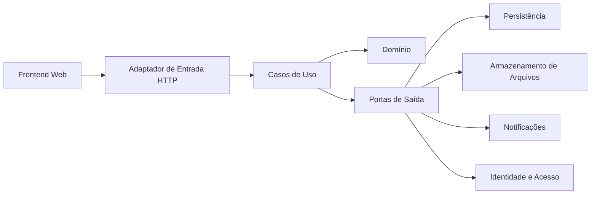

# Visão Geral da Arquitetura

## 1. Contexto

A Esteira Habitacional organiza o ciclo operacional de financiamentos, incluindo:

- processo de financiamento;
- participantes;
- etapas;
- documentos e versões;
- solicitações documentais;
- pendências;
- próximas ações;
- histórico e auditoria;
- notificações e acompanhamento.

A plataforma não toma decisão bancária oficial e não substitui sistemas internos dos bancos.

## 2. Estilo arquitetural recomendado

Para o MVP, a recomendação é um **monólito modular**, implementado com princípios de **Arquitetura Hexagonal**, **Clean Architecture** e **DDD pragmático**.

A escolha evita a complexidade operacional de microsserviços e, ao mesmo tempo, preserva fronteiras internas claras.



## 3. Camadas conceituais

### 3.1 Domínio

Contém regras de negócio, entidades, objetos de valor, políticas, serviços de domínio e eventos de domínio.

Não conhece:

- Spring;
- JPA;
- HTTP;
- JSON;
- banco de dados;
- armazenamento S3;
- bibliotecas de segurança;
- detalhes de mensageria.

### 3.2 Aplicação

Contém casos de uso e coordena o domínio.

Responsabilidades:

- validar pré-condições de aplicação;
- carregar agregados por portas;
- executar comportamento de domínio;
- persistir mudanças por portas;
- publicar eventos;
- controlar transações;
- retornar resultados de aplicação.

### 3.3 Adaptadores de entrada

Exemplos:

- controllers REST;
- consumidores de mensagens, futuramente;
- jobs agendados;
- comandos administrativos.

Eles traduzem o mundo externo para comandos/consultas da aplicação.

### 3.4 Adaptadores de saída

Exemplos:

- repositórios JPA;
- armazenamento privado de arquivos;
- e-mail;
- mensagens assistidas de WhatsApp;
- provedor de autenticação;
- auditoria técnica.

### 3.5 Infraestrutura

Contém detalhes técnicos e configuração do runtime.

## 4. Direção das dependências

As dependências sempre apontam para dentro:

```text
Infraestrutura -> Aplicação -> Domínio
Adaptadores    -> Aplicação -> Domínio
Domínio        -> nada externo
```

O domínio define conceitos. A infraestrutura implementa contratos definidos pelas camadas internas.

## 5. Unidade de implantação

No MVP:

- um backend;
- um banco relacional;
- um armazenamento privado de documentos;
- um frontend web;
- um pipeline de entrega;
- um conjunto único de observabilidade.

Separação em novos serviços só deve ocorrer quando existir pressão concreta de escala, segurança, autonomia de equipe, ciclo de implantação ou isolamento operacional.
